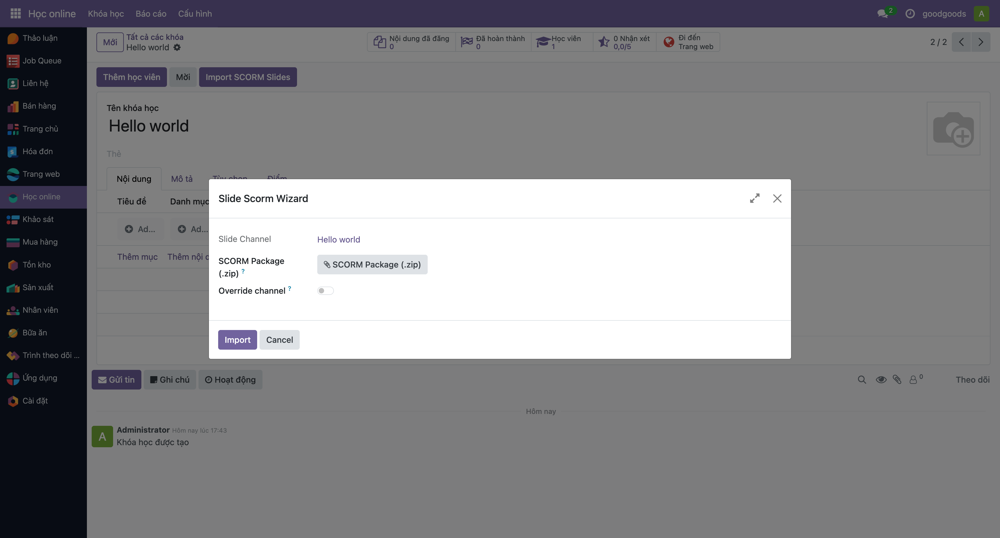

# namtn_scorm

# NAMTN SCORM Integration for Odoo eLearning

Enhance Odoo eLearning (Website Slides) with full **SCORM 1.2 & 2004** support. Upload, track, and manage SCORM courses seamlessly.

---

## Features

- 📂 Upload and import SCORM packages (.zip)
- 🎓 Integration with Website Slides
- 📊 Track learner progress and scores automatically
- 🕹️ Full-screen player mode for distraction-free learning
- ⭐ Portal rating and feedback support
- 🔒 Access rights and role management

---

## Installation

1. Clone this repository into your Odoo `addons` folder:

```bash
git clone https://github.com/yourgithub/namtn_scorm.git
```

2. Update the apps list in Odoo.
3. Install the "NAMTN SCORM Integration for eLearning" module.

---

## Usage

1. Go to eLearning → Courses.
2. Create a new course or edit an existing one.
3. Click "Upload SCORM" to import your SCORM package (.zip).
4. Publish the course for learners to access.

**Note:** Ensure your SCORM packages are valid. SCORM 1.2 and 2004 are supported.

---

## Screenshots



## Support

For any issues or questions, please contact us at sunnam9897@gmail.com.

---
